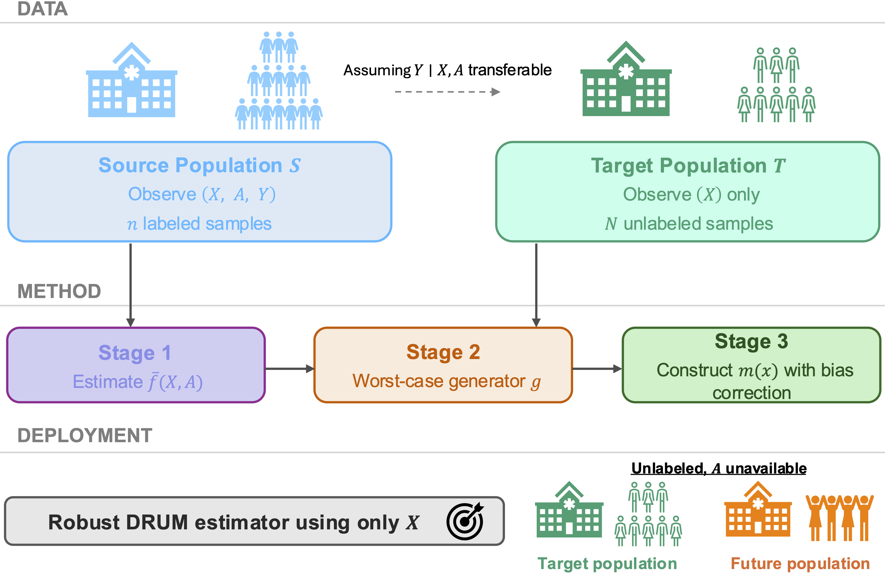
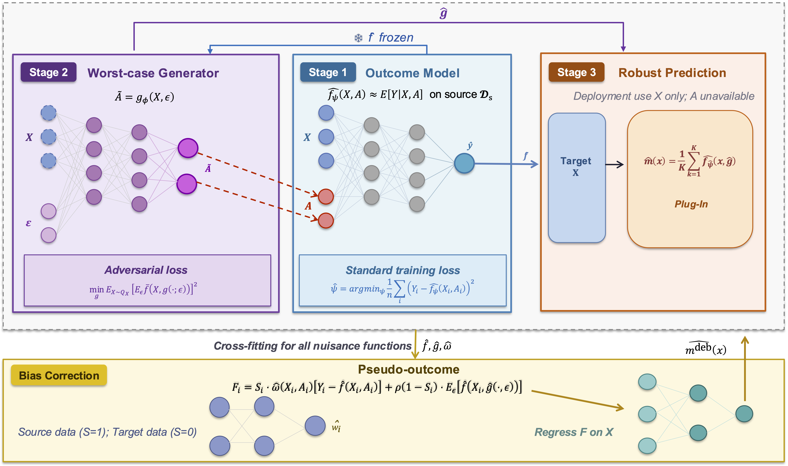

# DRUM: Distributionally Robust Unsupervised Transfer Learning with Structurally Missing Covariates

[](https://arxiv.org/abs/2605.24212)
[](https://opensource.org/licenses/MIT)
[](https://www.python.org/)

This repository contains the official Python implementation for **DRUM** (Distributionally Robust Unsupervised transfer learning with structurally Missing covariates), a framework for transferring prediction models to target domains where key features are completely absent or unstable and outcome labels are unavailable. 

---

## 📌 Overview

Prediction models are increasingly trained at high-resource centers and then deployed across systems whose data infrastructure is far leaner. This creates a recurring failure mode: some of the most predictive covariates recorded during training are never collected at the deployment site — not missing at random for a handful of subjects, but absent for the entire target population. Compounding the problem, outcome labels at the new site are frequently unavailable, so the model cannot simply be retrained or supervised into shape.

**DRUM** is built for exactly this setting. It partitions the covariates into a shared block $X$, observed everywhere, and a structurally missing block $A$, observed only in the source domain. Rather than imputing $A$ under untestable assumptions, DRUM learns a predictor $m(X)$—using only the shared covariates—that optimizes worst-case predictive performance over the unknown target distribution of $A \mid X$.

The result is a single, label-free, deployable predictor that transfers safely to many downstream populations — whether $A$ is mildly shifted, heavily missing, or entirely unavailable.

### 🖼️ DRUM Workflow & Pipeline

<p align="center">
  
  <br>
  <em>Figure 1: Overview of the DRUM transfer learning framework from source to unlabeled target sites.</em>
</p>

---

## 🌟 Why DRUM?

* **Structural Missingness Handled Directly:** Existing transfer-learning and domain adaptation methods assume a shared covariate space or assume the conditional law $A \mid X$ is stable across sites. DRUM requires neither.
* **No Target Labels Needed:** Estimation never uses target outcomes—the framework is genuinely unsupervised in the target domain.
* **Worst-Case Guarantees, Not Point Imputation:** Instead of guessing the target $A \mid X$, DRUM optimizes against an adversarial neighborhood of it, controlled by a robustness parameter $\delta$.
* **Bias-Correction for Finite Samples:** A Neyman-orthogonal pseudo-outcome with cross-fitting removes first-order sensitivity to nuisance estimation error.

<p align="center">
  
  <br>
  <em>Figure 2: Three-stage estimation pipeline and bias correction mechanism.</em>
</p>

---

## 🔄 Beyond Missing Data

Although DRUM is framed around structurally missing covariates, its formulation applies to any setting where covariates are available during training but absent or restricted at deployment. The same worst-case machinery carries over, with $A$ and the robustness parameter $\delta$ reinterpreted to fit the problem:

* **Unstable Covariates:** In clinical or physical environments, models trained under controlled conditions—with environmental factors such as temperature or specific machinery settings—must generalize to real-world settings where these factors shift unpredictably. Here, $A$ represents covariates that are observed but highly unstable, and $\delta$ controls the degree of protection against environmental variation.
* **Deliberately Excluded Covariates:** In algorithmic fairness, protected attributes such as race or sex may be available during training but impermissible to use at deployment. Here, $A$ represents covariates that are observed during development but deliberately excluded at inference. Optimizing over the worst-case conditional distribution reduces the predictor's downstream sensitivity to shifts in these protected attributes across deployment sites.

---

## ✍️ Citation

If you find our framework, code, or paper helpful in your research, please consider citing our work:

```bibtex
@article{li2026drum,
  title={Distributionally Robust Transfer Learning with Structurally Missing Covariates, with Application to Cross-National Cardiac Arrest Prediction},
  author={Li, Siqi and Hong, Chuan and Tian, Ziye and Leong, Benjamin Sieu-Hon and Nakagawa, Koshi and Tanaka, Hideharu and Shin, Sang Do and Dai, Khuong Quoc kai and Son, Do Ngoc and Ong, Marcus Eng Hock and Liu, Nan and Liu, Molei},
  journal={arXiv preprint arXiv:2605.24212},
  year={2026}
}
```

---

## 👥 Contact

* **Siqi Li**  <siqili@u.duke.nus.edu>
* **Molei Liu**  <moleiliu@bjmu.edu.cn>
